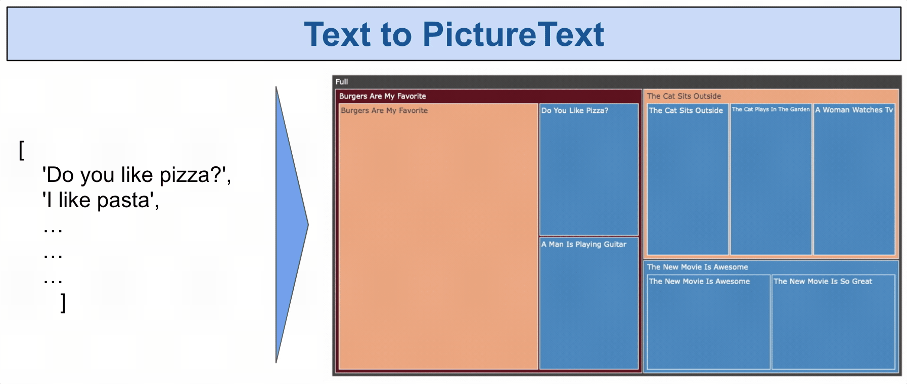
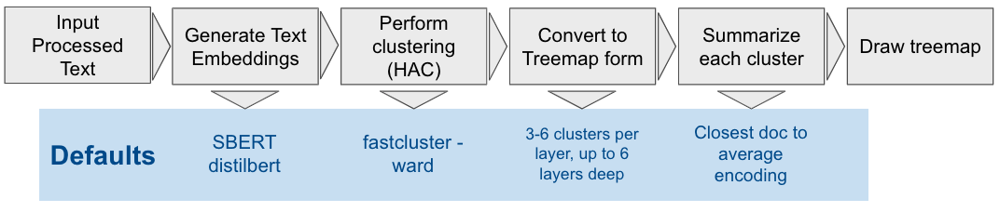

# PictureText
Hierarchical Clustering (HAC) with tree maps on text

<p align="center">
  
</p>

## Demo
Checkout the colab notebook

[](https://colab.research.google.com/drive/1mTrwk9hYl7bXYUr7e5hbCzv7Bim9ML8Y?usp=sharing)

## Getting started

### Installation
```py
conda create --name pt python=3.6
conda install -n pt nb_conda_kernels
conda activate pt
pip install -r requirements.txt
```

### A simple example
Consider the default values and their result
```py
txt=['The cat sits outside',
     'A man is playing guitar',
     'I love pasta',
     'The new movie is awesome',
     'The cat plays in the garden',
     'A woman watches TV',
     'The new movie is so great',
     'Do you like pizza?',
     'Burgers are my favorite',
     'I like chips',
     'I will have french fries with my burger'
       ]
from picture_text_summary import PictureText
# initializing just sets the text corpus
pt = PictureText(txt) 
# calling the method itself does the heavy lifting: 1. HAC and 2. text embedding 
pt() 
# This step outs it all together:
# 1. converts HAC into a treemap format
# 2. determines a summary for each cluster and 
# 3. draws & return a treemap
pt.make_picture() 
```
<p align="left">
  
</p>
### Outline of approach
<p align="left">
  
</p>
- Perform any required preprocessing to get to a list of document strings
- Embed / Encode all documents with the method of choice, by default I use [SBERT](https://www.sbert.net)
- Use HAC to get a “linkage” table of hierarchical assignments of each point to the rest of the data. Here I use [fastcluster](http://danifold.net/fastcluster.html), ward linkage by default.
- Iteratively create “layers” by selecting a roughly set number of splits to each layer
- Generate a summary for each layer. In the default setting, I use the point closest to the average of the cluster. Using the average of the cluster to represent its centroid is used in a number of few-shot, unsupervised settings
- Use [plotly](https://plotly.com/)'s [treemap](https://plotly.com/python/treemaps/) for interactive visualization

## Customization

Consider the default values and their result
```python
from picture_text_summary import PictureText
pt = PictureText(txt)
pt(hac_method='ward', hac_metric='euclidean')
pt.make_picture(layer_depth = 6,
                layer_min_size = 0.1,
                layer_max_extension = 1,
                treemap_average_score = None, 
                treemap_maxdepth=3,)
```
<p align="left">
  
</p>

### Customizing layers
Changing `layer_depth` parameter sets the number of layers produced by the split.
```python
pt.make_picture(layer_depth = 1)
```
<p align="left">
  
</p>

Changing `layer_min_size` parameters determines what is the minimal acceptable size of a new cluster for each layer. By default `layer_min_size` is 0.1 (or 10%) meaning if a layer has a cluster smaller than 10% we will try to find another cluster to add to the layer hoping that the next one will be bigger. We will do so up to increasing the relative number of additional clusters up to 1 (or 100%, `layer_max_extension` = 1). Increasing both of these significantly basically means that we get a lot more clusters a lot earlier.

```python
pt.make_picture(layer_depth = 1,
                layer_min_size = 0.9,
                layer_max_extension = 3,
                )
```
<p align="left">
  
</p>

### Customizing clustering methods

```python
pt = PictureText(txt)
pt(hac_method='ward', hac_metric='euclidean')
```

## BYO-NLP
The key features to this sort of approach are the embeddings as well as the method of multi-doc summarization. You can use your NLP tools of choice there.

### Text embeddings
The default set of text embeddings is via [SBERT](https://www.sbert.net)'s `distilbert-base-nli-stsb-mean-tokens`
```python
from picture_text_summary import sbert_encoder
pt = PictureText(txt)
pt(encoder=sbert_encoder)
```

### Summarizer
```python
def silly_summarizer(txt,txt_embeddings):
   return "All the same to me", 0
pt.make_picture(summarizer = silly_summarizer,)
```
<p align="left">
  
</p>
