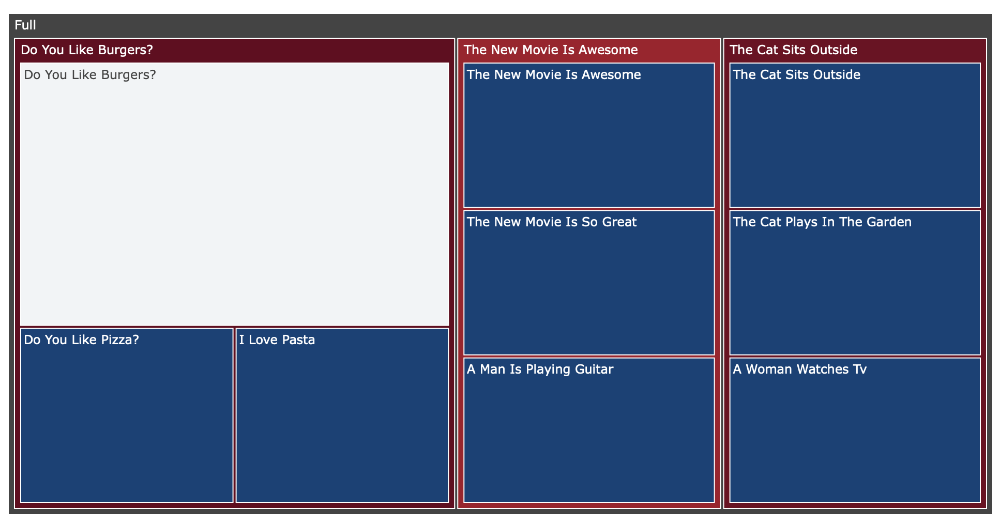
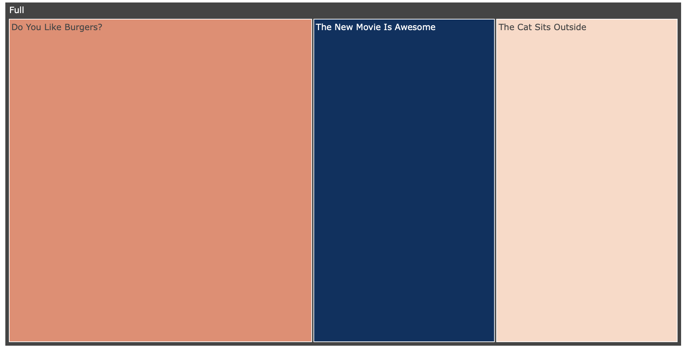
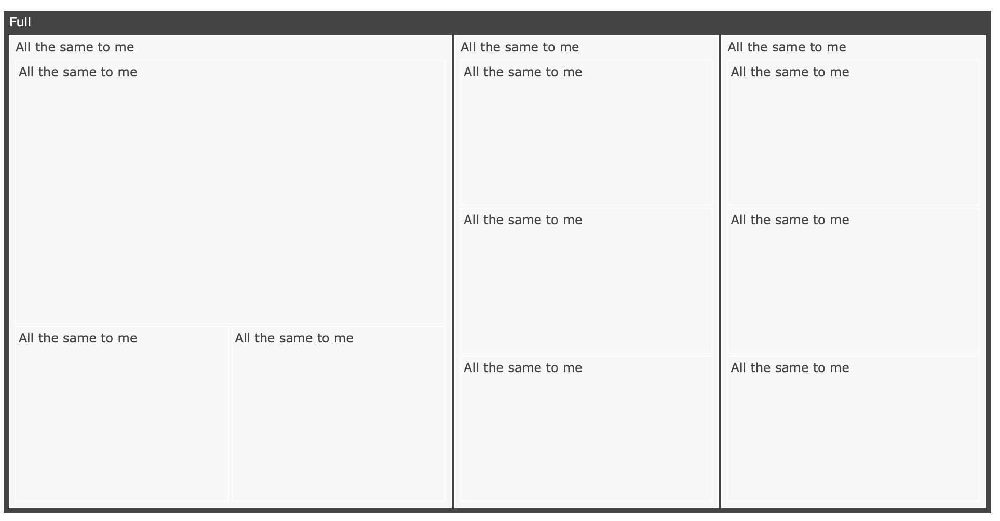

# picture_text
Hierarchical Clustering (HAC) with tree maps on text

<p align="center">
  
</p>

## Demo
Checkout the colab notebook

[](https://colab.research.google.com/drive/1INBPsgjhF1ikejOPgoi6yXM02_OrUEK7?usp=sharing)

## Getting started

```py
conda create --name pt python=3.6  
conda install -n pt nb_conda_kernels
conda activate pt
pip install -r requirements.txt
```

## Customization
Consider the default values and their result
```python
pt = PictureText(txt)
pt(hac_method='ward', hac_metric='euclidean')
pt.make_picture(layer_depth = 6,
                layer_min_size = 0.1,
                layer_max_extension = 1,
                treemap_average_score = None, 
                treemap_maxdepth=3,)
```
<p align="left">
  
</p>
### Customizing layers
Changing `layer_depth` parameter sets the number of layers produced by the split.
```python
pt.make_picture(layer_depth = 1)
```
<p align="left">
  
</p>
Changing `layer_min_size` parameters determines what is the minimal acceptable size of a new cluster for each layer. By default `layer_min_size` is 0.1 (or 10%) meaning if a layer has a cluster smaller than 10% we will try to find another cluster to add to the layer hoping that the next one will be bigger. We will do so up to increasing the relative number of additional clusters up to 1 (or 100%, `layer_max_extension` = 1). Increasing both of these significantly basically means that we get a lot more clusters a lot earlier.

```python
pt.make_picture(layer_depth = 1,
                layer_min_size = 0.9,
                layer_max_extension = 3,
                )
```
<p align="left">
  
</p>

### Customizing clustering methods

```python
pt = PictureText(txt)
pt(hac_method='ward', hac_metric='euclidean')
```

## BYO-NLP
The key features to this sort of approach are the embeddings as well as the method of multi-doc summarization. You can use your NLP tools of choice there.
#### Text embeddings
The default set of text embeddings is via [SBERT](https://www.sbert.net)'s `distilbert-base-nli-stsb-mean-tokens`
```python
pt = PictureText(txt)
pt(hac_method='ward', hac_metric='euclidean')
```

#### Summarizer
```python
def silly_summarizer(txt,txt_embeddings):
   return "All the same to me", 0
pt.make_picture(summarizer = silly_summarizer,)
```
<p align="left">
  
</p>
